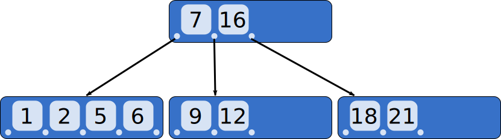

# B-trees-on-C

A B-tree is a balanced tree data structure. B-Trees are mainly used in database and file system management mechanisms [(Read more on Wikipedia)](https://en.wikipedia.org/wiki/B-tree).

**B-trees-on-C** is a simple, optimized and structure-adaptable b-trees​ implementation in C.

## B-Tree illustration
---


## Quick tour
---
First provide a **data_type** by editing [data_type.h](./data_type.h) and a **comparator** in [data_type.c](./data_type.c)

```C
/* -----------------------
    data_type.h
   -----------------------
*/

typedef int btree_dtype;

/* -----------------------
    data_type.c
   -----------------------
*/

// provide order relation
int comparator(btree_dtype a, btree_dtype b)
{
    if(a > b)
        return 1; // positive if a > b
    if(a < b)
        return -1; // negative if a < b
    return 0; // 0 if equal
}
```

- Init a b-tree:

` btree bt = btree_init(comparator); `

- Insertion:

```C 
int status = btree_insert(&bt, value);

if(status > 0)
    printf("value successfully inserted into b-tree");
else if(status < -1)
    printf("value already present in the tree");
else // status == 0
    print("an error occured while trying to insert");
```

- Search:

```C
btree_dtype value_to_seek = 25;
int doProvidePile = 0; // set to 1 if a pile of walked-through nodes is wanted

btree_seek_coord coord = btree_seek_coord btree_seek(bt, value_to_seek, doProvidePile, NULL);

if(coord.pos < 0)
    printf("value not in the tree")
else
    print("value found at the node stored @%d and at offset %d", coord.node, coord.pos);
```

- Delete a value from the tree:

```C
int status = btree_delete(&bt, 25);
if(status > 0)
    printf("success!\n");
else if(status < 0)
    printf("an error occured while trying to delete the value");
else // status
    printf("value not in the b-tree");
```
- Destroy the tree (recursively):

`btree_destroy(bt) // no return value`

# Author

This project was implemented by *Hakim Beldjoudi* (@hbFree).